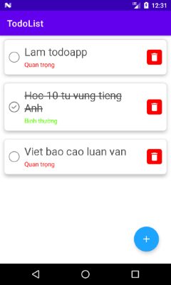
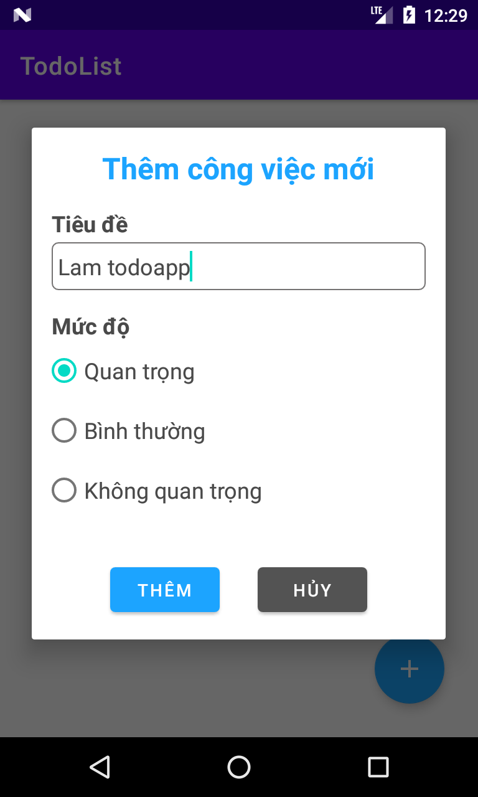

## Todoapp
- Sử dụng SQLite để lưu trữ dữ liệu cục bộ trên máy
- Bao gồm các chức năng thêm, sửa, xóa công việc

## Giao diện màn hình chính
Công việc nào đã hoàn thành (đã được check) thì sẽ bị gạch ngang tiêu đề

## Giao diện form thêm công việc

## Giao diện form cập nhật công việc
Nhấn vào công việc cần cập nhật để mở form

